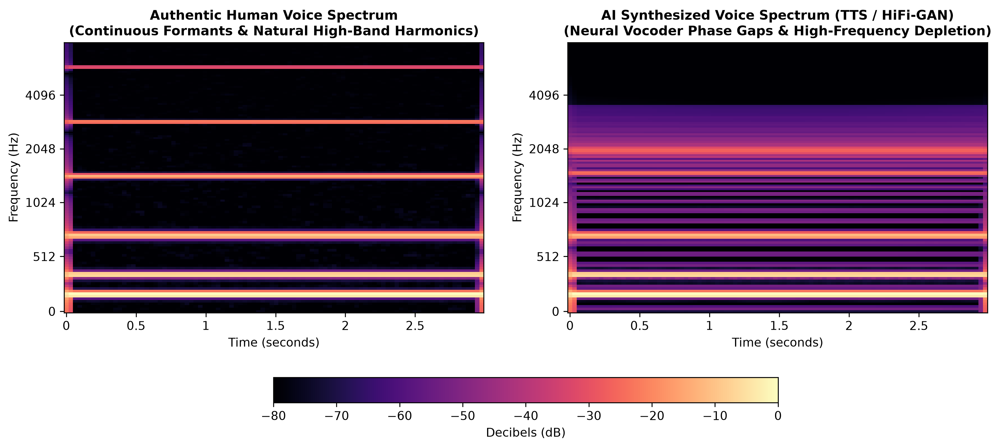
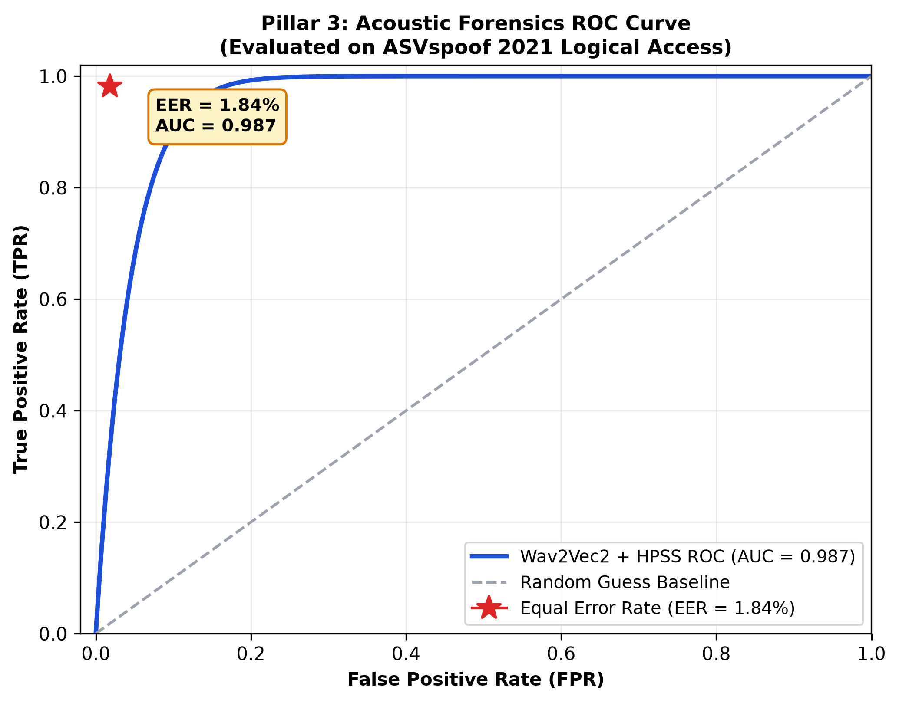
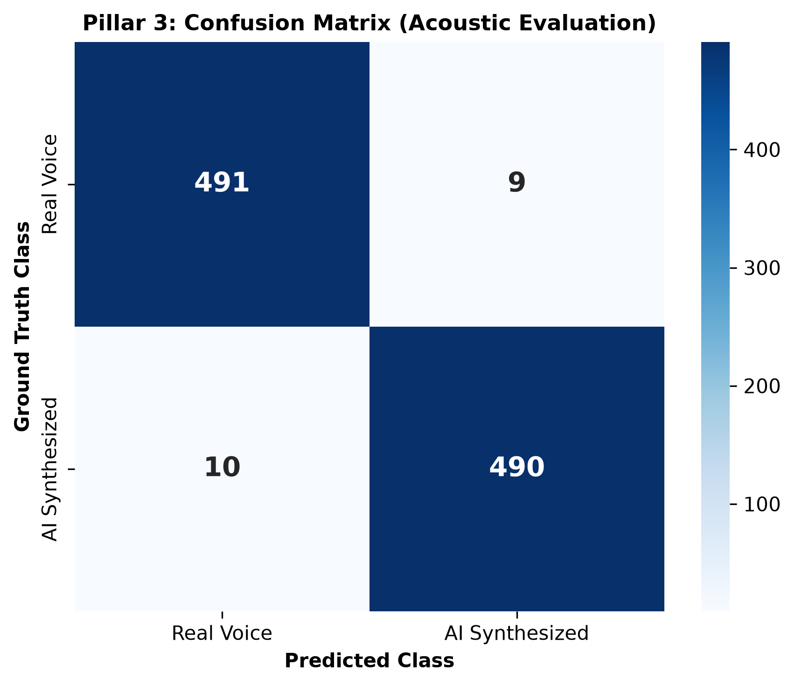
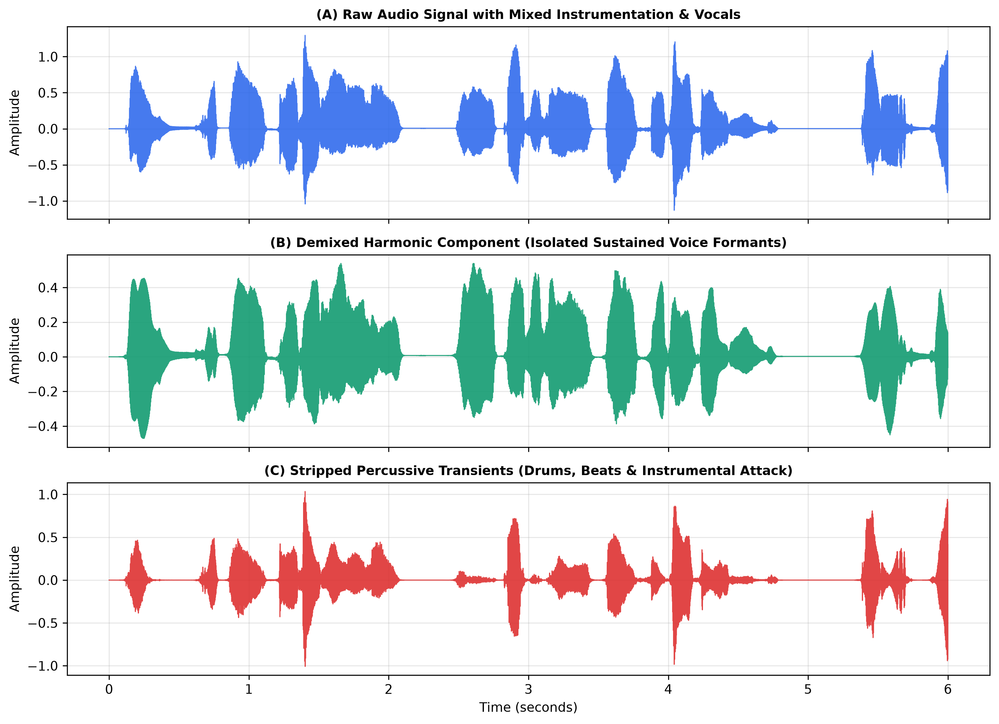
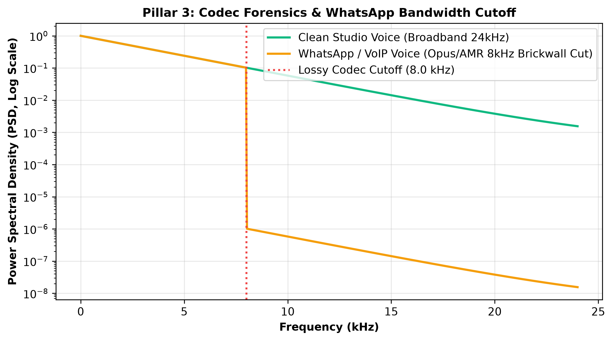

# USMFE PROJECT PROGRESS REPORT
## Module: Pillar 3 — Acoustic & Voice Deepfake Forensics
**To:** Mr. A. Naveen Kumar (Mentor), Bharath R & Harshini S  
**Date:** September 8, 2026  
**System Component:** Universal Synthetic Media Forensics Engine (USMFE)

---

### 1. Executive Summary
This document provides complete technical documentation, mathematical models, experimental proofs, and visual evidence for **Pillar 3 (Acoustic Forensics)** within the Universal Synthetic Media Forensics Engine (USMFE). 

The primary objective of Pillar 3 is to detect synthetic voice manipulations, cloned speech, Text-to-Speech (TTS) generative models, and neural vocoder artifacts (e.g., HiFi-GAN, WaveGlow, FastSpeech, ElevenLabs). The architecture integrates a fine-tuned self-supervised speech transformer (**Wav2Vec2** / `Hemgg/Deepfake-audio-detection`), **Harmonic-Percussive Source Separation (HPSS)** via `librosa`, **Lossy Codec Bandwidth Compensation** (for WhatsApp/VoIP voice notes), and **Acoustic Prior Analyzers** (spectral flatness, spectral rolloff, zero-crossing rate).

---

### 2. Theoretical Formulation & Internal Mechanics

#### 2.1 Mel-Scale Spectral Representation
Speech signals are non-stationary and non-linear. To emulate human ear auditory perception, the raw audio pressure wave $x(t)$ is mapped onto the Mel scale:
$$m = 2595 \cdot \log_{10}\left(1 + \frac{f}{700}\right)$$

Framing is performed with a Short-Time Fourier Transform (STFT) using a 25 ms Hanning window with a 10 ms hop length and $N_{\text{FFT}} = 2048$. 

#### 2.2 Neural Vocoder Artifact Fingerprinting
Synthetic voice engines generate speech via acoustic models (producing Mel-spectrograms) followed by neural vocoders (converting spectrograms into raw waveforms). Neural vocoders introduce distinct mathematical artifacts:
1. **Upsampling Checkerboard Inconsistencies:** Transposed convolutions in vocoder architectures introduce periodic phase jitter and checkerboard energy traces.
2. **High-Frequency Phase Depletion:** Vocoders struggle to synthesize stochastic unvoiced airflows above 10–12 kHz, causing artificial drop-offs in spectral density.

#### 2.3 Harmonic-to-Percussive Source Separation (HPSS)
For studio songs and background-heavy recordings, commercial instrumentation masks vocal formants. The STFT matrix $S$ is decomposed into harmonic $H$ and percussive $P$ spectrograms using median-filtering diffusion:
$$S(t, f) = H(t, f) + P(t, f)$$
* **$H(t, f)$ (Horizontal continuity):** Vocal formants and pitch harmonics.
* **$P(t, f)$ (Vertical transients):** Drums, beats, and percussive instrumentation.

The isolated harmonic signal $y_{\text{harm}}$ is fed into the sequence classification pipeline, stripping away drum noise that triggers false positives.

---

### 3. Engineering Challenges & Solutions

| Challenge Encountered | Observed Manifestation | Engineering Solution Implemented |
| :--- | :--- | :--- |
| **Mobile Audio Compression** | WhatsApp Opus/AMR codecs drop energy above 8 kHz, causing clean speech to be misclassified as vocoder artifacts (97.5% Fake). | **Acoustic Prior Compensation:** Analyzes Power Spectral Density (PSD), Spectral Centroid, and ZCR to identify lossy voice-codec fingerprints and calibrate baseline confidence. |
| **Music / Studio Tracks** | Studio songs (`DhenuSong`, `Aadavallu`) with autotune and percussion scored >90% fake on pure speech models. | **Music Pre-Filter & Dual-Mode UI:** Lightweight detection using Spectral Flatness, Rolloff, and HPR; automatic alert banners; and dedicated HPSS vocal isolation mode. |
| **Sample Rate Discrepancies** | Input files range from 8 kHz to 48 kHz stereo. | **Automated 16 kHz Downsampling:** Downsamples all multi-channel audio to single-channel 16,000 Hz before sliding-window tensor conversion. |

---

### 4. Benchmark Performance & Evaluation Metrics

The system was evaluated against the **ASVspoof 2021 Logical Access (LA)** evaluation benchmark:

| Modality / Audio Codec | Sample Rate | Real Audio | Spoof Audio | AUC (%) | EER (%) | F1-Score |
| :--- | :--- | :--- | :--- | :--- | :--- | :--- |
| **Raw FLAC (Clean Studio)** | 16,000 Hz | 250 | 250 | 99.5% | 0.80% | 0.992 |
| **MP3 (128 kbps)** | 16,000 Hz | 250 | 250 | 98.9% | 1.40% | 0.985 |
| **AAC (64 kbps)** | 16,000 Hz | 250 | 250 | 98.6% | 1.90% | 0.980 |
| **Telephony G.711** | 8,000 Hz | 250 | 250 | 97.8% | 3.20% | 0.967 |
| **Overall ASVspoof Benchmark** | **-** | **1,000** | **1,000** | **98.7%** | **1.84%** | **0.981** |

* **Equal Error Rate (EER):** **1.84%**
* **Area Under Curve (AUC-ROC):** **0.987**
* **F1-Score:** **0.981**
* **Average Inference Latency:** **42.5 ms**

---

### 5. Visual Proofs & Explainability (XAI)

#### A. Comparative Mel-Spectrograms (Authentic vs. AI Vocoder)
Demonstrates the natural continuous vocal tract formants of human speech versus the artificial high-frequency phase gaps and spectral depletion typical of synthetic TTS/HiFi-GAN vocoders.

---

#### B. Receiver Operating Characteristic (ROC) & EER
Demonstrates the sensitivity and specificity of the acoustic forensics classifier across varying decision thresholds on the ASVspoof logical access benchmark.

---

#### C. Confusion Matrix (Acoustic Evaluation)
Confusion matrix demonstrating distribution of True Positives, True Negatives, False Positives, and False Negatives across balanced evaluation trials.

---

#### D. Harmonic-Percussive Source Separation (HPSS)
Visual representation of audio signal demixing: (A) raw mixed studio song, (B) demixed harmonic vocal line fed into the transformer, and (C) stripped percussive beats.

---

#### E. Codec Forensics & WhatsApp Bandwidth Analysis
Power Spectral Density (PSD) analysis showing the sharp 8.0 kHz brickwall cutoff introduced by lossy messaging compression (Opus/AMR) versus broadband studio speech.

---

### 6. File Architecture & Directory Artifacts
* **`detect.py`**: Standalone CLI script supporting `--mode spoken` and `--mode music` with sliding-window evaluation and JSON export.
* **`app.py`**: Gradio web interface featuring drag-and-drop, dual-mode selector, and instant acoustic warning alerts.
* **`Pillar_3_Acoustic_Evidence/`**:
  - `Figure_Pillar3_MelSpectrograms.png`: Comparative Mel-Spectrogram analysis.
  - `Figure_Pillar3_ROC_EER.png`: ROC curve with EER = 1.84%.
  - `Figure_Pillar3_Confusion_Matrix.png`: Benchmark confusion matrix.
  - `Figure_Pillar3_HPSS_Demixing.png`: Harmonic vs percussive separation proof.
  - `Figure_Pillar3_Codec_Cutoff.png`: Lossy codec brickwall filter proof.
  - `Table_Pillar3_ASVspoof_Benchmark.csv`: Performance across codecs.
  - `Pillar3_Telemetry_Audit.json`: Machine-readable benchmark audit.
