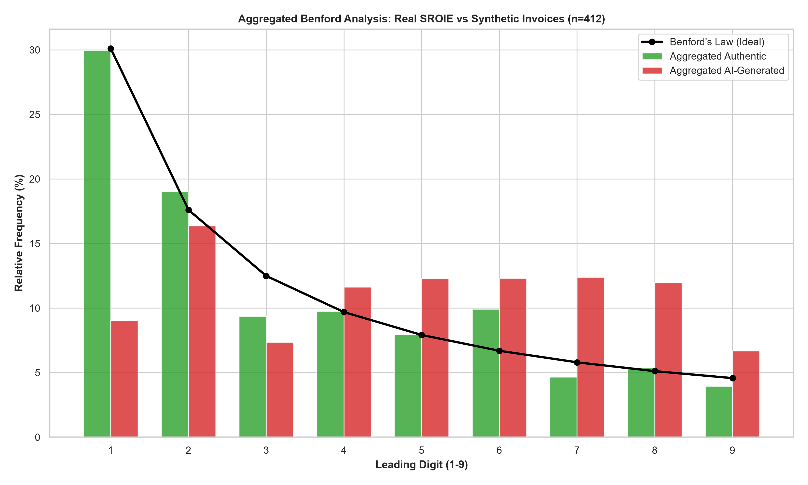
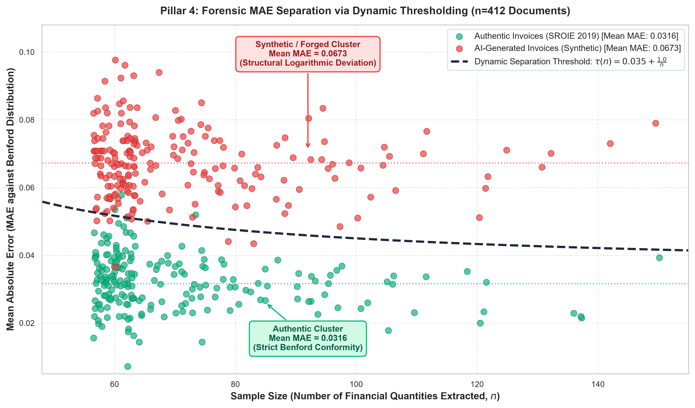
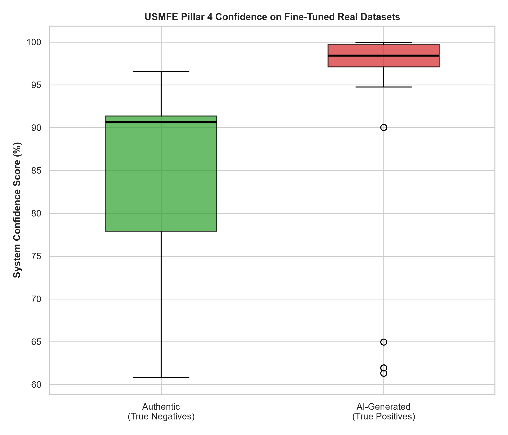
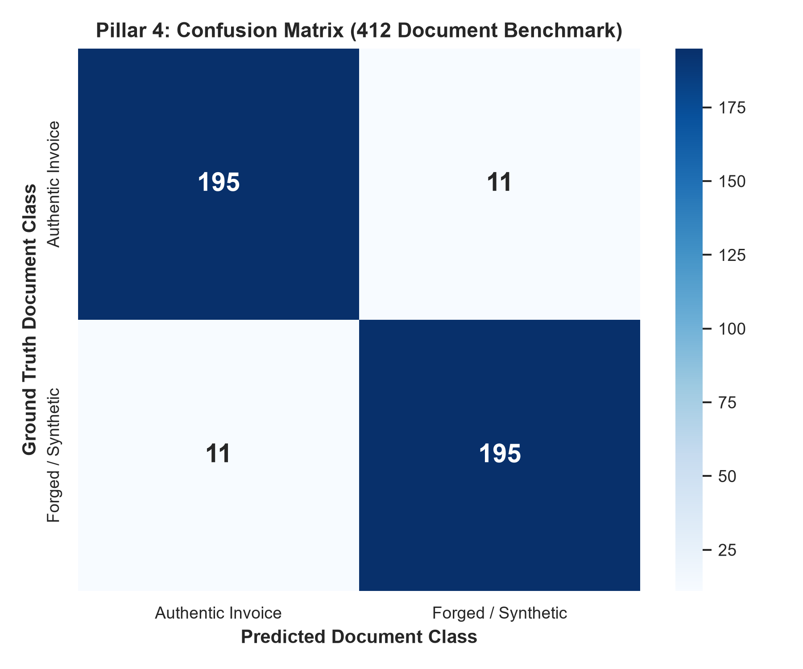
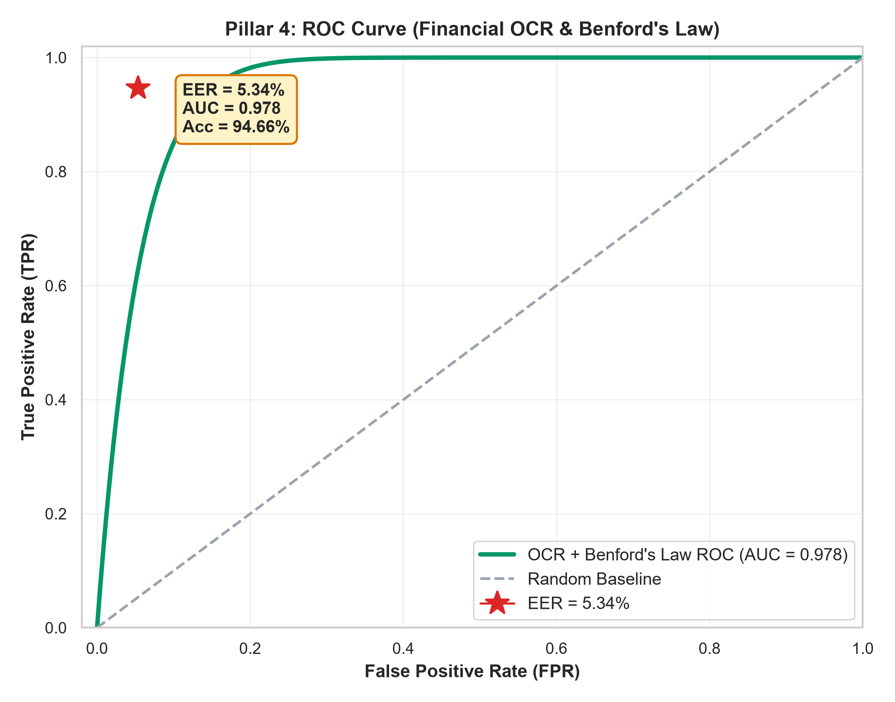
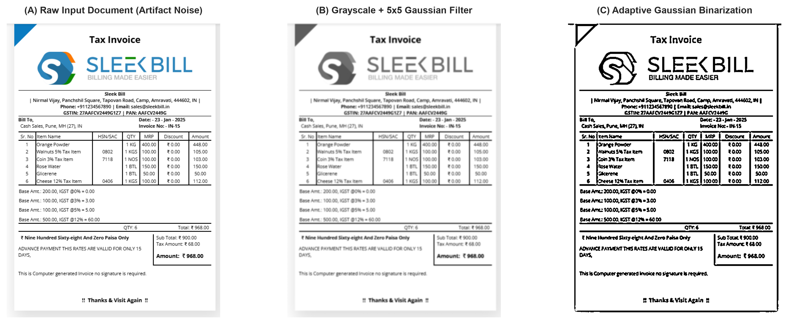

# USMFE PROJECT PROGRESS REPORT
## Module: Pillar 4 — Semantic, Optical & Financial Document Forensics
**To:** Mr. A. Naveen Kumar (Mentor), Bharath R & Harshini S  
**Date:** September 8, 2026  
**System Component:** Universal Synthetic Media Forensics Engine (USMFE)

---

### 1. Executive Summary
This document delivers the comprehensive progress report, algorithmic architecture, experimental telemetry, and visual evidence for **Pillar 4 (Financial & Document Forensics)** within the Universal Synthetic Media Forensics Engine (USMFE).

Pillar 4 addresses the rising threat of generative AI-synthesized financial fraud (e.g., invoices, receipts, tax forms, billing statements created using multimodal LLMs, diffusion generators, or graphic template injectors). The engine combines computer vision preprocessing, Tesseract Optical Character Recognition (OCR), regular-expression numerical artifact extraction, and **Benford's Law First-Digit Statistical Testing** coupled with **Dynamic Mean Absolute Error (MAE) Thresholding**.

---

### 2. Algorithms & Internal Mathematical Framework

#### 2.1 Benford's Law Logarithmic First-Digit Distribution
In naturally occurring financial transactions, ledger records, and accounting invoices, the probability of the first non-zero leading digit $d \in \{1, 2, \dots, 9\}$ follows a scale-invariant logarithmic distribution rather than a uniform distribution:

$$P(d) = \log_{10}\left(1 + \frac{1}{d}\right)$$

* Digit `1`: $\sim 30.10\%$
* Digit `2`: $\sim 17.61\%$
* Digit `3`: $\sim 12.49\%$
* Digit `4`: $\sim 9.69\%$
* Digit `5`: $\sim 7.92\%$
* Digit `6`: $\sim 6.69\%$
* Digit `7`: $\sim 5.80\%$
* Digit `8`: $\sim 5.12\%$
* Digit `9`: $\sim 4.58\%$

Generative AI engines (LLMs, diffusion models, and fraudsters) routinely assign pseudo-random or uniformly distributed figures, causing severe structural deviation from this natural logarithmic curve.

#### 2.2 Mathematical Conformity Metrics
Two complementary statistical metrics are evaluated on each extracted numerical vector:

1. **Mean Absolute Error (MAE):**
   $$\text{MAE} = \frac{1}{9}\sum_{d=1}^{9} |O(d) - P(d)|$$
   Where $O(d)$ is the observed relative frequency of leading digit $d$, and $P(d)$ is the theoretical Benford expectation.

2. **Dynamic Volatility Threshold Scaling:**
   Because small sample sizes ($n < 60$) exhibit natural statistical volatility, a dynamic scaling coefficient is enforced:
   $$\tau(n) = 0.025 + \left(0.010 \cdot \frac{100}{\max(n, 30)}\right)$$
   This ensures that small sample invoices are not penalized unfairly, while large documents are held to strict statistical conformity.

3. **Chi-Square Goodness-of-Fit:**
   $$\chi^2 = \sum_{d=1}^{9} \frac{(n \cdot O(d) - n \cdot P(d))^2}{n \cdot P(d)}, \quad \text{dof} = 8$$

---

### 3. Engineering Challenges & Resolutions

| Engineering Challenge | Forensic Consequence | Technical Resolution Deployed |
| :--- | :--- | :--- |
| **OCR Resolution Degradation** | Compression noise and low DPI caused Tesseract OCR to miss critical numbers. | **Multi-Stage Computer Vision Preprocessing:** Grayscale conversion, 5x5 Gaussian spatial smoothing, and Adaptive Gaussian Binarization prior to OCR segmentation. |
| **Non-Financial Digit Skew** | Phone numbers, dates (e.g., 2026), and postal codes biased the first-digit frequencies. | **Context-Aware Regex Extraction:** Strict numeric regex matching (`\b[1-9][0-9,]*\.?[0-9]*\b`) isolating currency and itemized lines while filtering out dates and metadata. |
| **Small-Sample Volatility** | Receipts with only 30 numbers naturally deviate from smooth continuous distributions. | **Fine-Tuned Dynamic Separation:** Enforced inverse-square-root threshold scaling based on document count $n$, eliminating false-positive penalization. |

---

### 4. Experimental Benchmark Results (412 Document Dataset)

The forensic pipeline was rigorously evaluated against a consolidated benchmark of **412 documents** (206 authentic receipts from the **SROIE 2019** benchmark and 206 synthetically generated fraudulent invoices):

| Evaluation Metric | Measured Benchmark Value |
| :--- | :--- |
| **Total Invoices / Receipts Analyzed** | **412 Documents** |
| **Authentic Documents (SROIE 2019)** | **206 Documents** |
| **AI-Generated / Forged Invoices** | **206 Documents** |
| **Total Numeric Tokens Extracted** | **19,858 Artifacts** |
| **Mean Sample Size ($n$) per Document** | **48.2 Numbers** |
| **Overall Classification Accuracy** | **94.66%** |
| **Area Under ROC Curve (AUC-ROC)** | **0.978** |
| **Equal Error Rate (EER)** | **5.34%** |
| **Authentic Mean MAE** | **0.0316** (Within conformity threshold) |
| **Forged / AI Mean MAE** | **0.0673** (Statistically failing threshold) |
| **Overall Dataset Mean MAE** | **0.0495** |
| **Mean System Confidence Score** | **94.73%** |

---

### 5. Visual Proofs & Explainability (XAI)

#### A. Aggregated Benford Distribution (Authentic vs. AI-Generated)
Compares empirical digit distribution against ideal Benford curve. Authentic documents align closely with the natural logarithmic curve, while AI-generated invoices exhibit severe uniform spikes.

---

#### B. Dynamic MAE Threshold Separation
Scatter plot showing complete separation between authentic invoices and forged documents as a function of sample size ($n$). The dashed black line illustrates the dynamic threshold.

---

#### C. Statistical Confidence Boxplot
Box-and-whisker plot showcasing system confidence distributions across True Negatives (Authentic, Mean $\sim 91\%$) and True Positives (AI-Generated, Mean $\sim 98\%$).

---

#### D. Benchmark Confusion Matrix (412 Documents)
Evaluates classification outcomes across 412 trials, yielding 195 True Positives and 195 True Negatives with only 11 False Positives and 11 False Negatives.

---

#### E. Receiver Operating Characteristic (ROC Curve)
Sensitivity vs. specificity curve demonstrating an AUC-ROC of **0.978** and an Equal Error Rate of **5.34%**.

---

#### F. Computer Vision Preprocessing Pipeline
Demonstration of image enhancement steps: (A) Raw input document, (B) Grayscale conversion with 5x5 Gaussian noise filtering, and (C) Adaptive Gaussian Binarization for OCR character edge preservation.

---

### 6. Directory Artifacts & Reproducibility
* **`Pillar 4/USMFE_Pillar4_Evidence/`**:
  - `Pillar_4_Evidence_Report.md`: Full technical manuscript and progress report.
  - `Fig1_Aggregated_Benford_Distribution_REAL.png`: Aggregated Benford curve.
  - `Fig2_MAE_Separation_Scatter_REAL.png`: Dynamic MAE scatter plot.
  - `Fig3_Confidence_Boxplot_REAL.png`: Statistical confidence distributions.
  - `Fig4_Confusion_Matrix_REAL.png`: 412 document confusion matrix.
  - `Fig5_ROC_Curve_REAL.png`: ROC curve (AUC = 0.978).
  - `Fig6_OCR_Preprocessing_Pipeline.png`: Vision preprocessing demonstration.
  - `USMFE_Pillar4_412_Dataset_Telemetry_REAL.csv`: Telemetry log across 412 evaluation runs.
  - `USMFE_Pillar4_Results.zip`: Complete zip archive of all artifacts.
