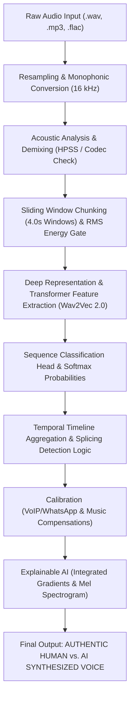

Searched for "pillar3"
Viewed pillars_integrated.py:315-370
Searched for "def classify_audio"
Viewed detect.py:115-250
Viewed detect.py:251-360
Viewed detect.py:30-115
Viewed detect.py:1-30
Viewed detect.py:355-430
Viewed Pillar_3_Manuscript_Section.md:1-17
Viewed xai.py:140-250
Viewed pillar3_xai.py:1-100

An in-depth, step-by-step breakdown explains exactly how **Pillar 3 (Acoustic & Voice Deepfake Forensics)** operates, the mathematical formulas and algorithms behind it, and a numerical walk-through with an example comparison.

---

### System Architecture Overview

---

### Step 1: Ingestion, Resampling & Preprocessing
*Source: [`detect.py:L140-152`](file:///d:/College%20Studies/Mini%20Project/Pillar%203/detect.py#L140-L152)*

1. **Standardization to $16\text{ kHz}$ Mono**:
   Human speech formants and vocal tract resonance characteristics are contained within the $0 - 8\text{ kHz}$ Nyquist band. All audio files are decoded into a continuous 1D floating-point array $y \in [-1.0, 1.0]$ at a sampling rate $f_s = 16000\text{ Hz}$.
2. **Frequency-to-Mel Mapping**:
   Human ear perception is non-linear. The Mel-frequency scale is computed as:
   $$m = 2595 \cdot \log_{10}\left(1 + \frac{f}{700}\right)$$
   Frames are computed with an FFT window of $N=2048$ ($25\text{ ms}$) and hop size $R=160$ samples ($10\text{ ms}$).

---

### Step 2: Acoustic Composition, Music & Codec Detection
*Source: [`detect.py:L44-120`](file:///d:/College%20Studies/Mini%20Project/Pillar%203/detect.py#L44-L120)*

Synthetic speech detectors often trigger false alarms on percussion/beats, or fail when audio is compressed over messaging apps (WhatsApp Opus/AMR). Pillar 3 performs acoustic signal decomposition:

1. **Harmonic-Percussive Separation (HPSS)**:
   Splits audio into harmonic voice $y_{\text{harm}}$ and transient percussion $y_{\text{perc}}$ via median filtering along spectrogram time and frequency axes:
   $$\text{HPR} = \frac{\frac{1}{N}\sum y_{\text{harm}}^2}{\frac{1}{N}\sum y_{\text{perc}}^2 + \epsilon}$$
   - If $\text{HPR} > 1.4$ or music mode is enabled, Pillar 3 separates the vocal track and normalizes:
     $$y_{\text{eval}} = \frac{y_{\text{harm}}}{\max(|y_{\text{harm}}|) + 1e-8}$$
     *Eliminating drum hits that cause false vocoder flags.*
2. **Spectral Flatness & Rolloff**:
   - **Spectral Flatness** evaluates tone vs. noise:
     $$\text{Flatness} = \frac{\exp\left(\frac{1}{K}\sum_{k=1}^K \ln S(k)\right)}{\frac{1}{K}\sum_{k=1}^K S(k)}$$
   - **Spectral Rolloff ($85\%$)**: Frequency $f_c$ below which $85\%$ of spectral energy lies.
   - **VoIP / WhatsApp Codec Detection**: If $\text{Rolloff} < 2800\text{ Hz}$, $\text{Spectral Centroid} < 900\text{ Hz}$, and $\text{Flatness} < 0.015$, the audio is identified as lossy compressed telephony/VoIP speech.

---

### Step 3: Chunking & Silence / RMS Energy Gating
*Source: [`detect.py:L170-246`](file:///d:/College%20Studies/Mini%20Project/Pillar%203/detect.py#L170-L246)*

1. **Adaptive Sliding Window**:
   - Chunk window: $W = 4.0\text{ seconds}$ ($64,000$ samples).
   - If $\text{duration} \le 150\text{s}$, $\text{hop} = 4.0\text{s}$ (contiguous, 100% full coverage, no blind spots).
   - For long audio, hop scales dynamically ($5\text{s}$ to $10\text{s}$).
2. **RMS Energy Gate (Dead Air Elimination)**:
   Global RMS:
   $$\text{RMS}_{\text{global}} = \sqrt{\frac{1}{M}\sum_{i=1}^M y_i^2}$$
   Threshold: $\theta_{\text{silence}} = \max(0.001, 0.05 \cdot \text{RMS}_{\text{global}})$.
   - Chunks below this threshold are flagged as silent (`is_silent = True`) and assigned neutral baseline logits $[P_{\text{fake}}=0.10, P_{\text{real}}=0.90]$, preventing silent breath gaps or room pause from biasing deep neural inference.

---

### Step 4: Neural Feature Representation & Inference
*Source: [`detect.py:L248-260`](file:///d:/College%20Studies/Mini%20Project/Pillar%203/detect.py#L248-L260)*

1. **Model Backbone**: Fine-tuned Wav2Vec 2.0 sequence classification model (`Hemgg/Deepfake-audio-detection`).
2. **Feature Extractor**:
   Raw audio waveforms are processed through temporal convolutional encoder layers:
   $$Z = \text{Conv1D}_{\text{layers}}(X)$$
   followed by multi-head contextual Transformer self-attention blocks:
   $$C = \text{TransformerEncoder}(Z)$$
3. **Classification Logits & Softmax**:
   For each non-silent chunk $j$, output logits $[z_{j,0}, z_{j,1}]$ are passed through Softmax:
   $$P_{\text{fake}}^{(j)} = \frac{e^{z_{j,0}}}{e^{z_{j,0}} + e^{z_{j,1}}}, \quad P_{\text{real}}^{(j)} = \frac{e^{z_{j,1}}}{e^{z_{j,0}} + e^{z_{j,1}}}$$
   *(Index 0 = AI Voice / Synthetic, Index 1 = Real Human Voice).*

---

### Step 5: Decision Logic & Splicing Detection
*Source: [`detect.py:L290-352`](file:///d:/College%20Studies/Mini%20Project/Pillar%203/detect.py#L290-L352)*

Pillar 3 does not rely solely on a simple average; it identifies **localized voice cloning / splicing** where an attacker alters only a small section (e.g., a spoken bank account number or password):

1. **Voice Mean**:
   $$\overline{P}_{\text{fake}} = \frac{1}{K}\sum_{j \in \text{VoiceChunks}} P_{\text{fake}}^{(j)}$$
2. **Peak Chunk & Ratio**:
   - $P_{\text{max\_fake}} = \max_j(P_{\text{fake}}^{(j)})$
   - $N_{\text{fake}} = \sum_j \mathbf{1}(P_{\text{fake}}^{(j)} \ge 0.70)$
   - $R_{\text{fake}} = \frac{N_{\text{fake}}}{K}$
3. **Verdict Determination**:
   - **Case A: Localized Splicing / Tampering**:
     If $N_{\text{fake}} \ge 2$, $R_{\text{fake}} < 0.60$, and $P_{\text{max\_fake}} \ge 0.85$:
     $$\text{Verdict} = \mathbf{FAKE} \quad (\text{Verdict Type: } \text{LOCALIZED\_TAMPERING}), \quad \text{Confidence} = P_{\text{max\_fake}} \times 100\%$$
   - **Case B: Fully Synthetic (TTS / Voice Clone)**:
     If $\overline{P}_{\text{fake}} \ge 0.50$ or $R_{\text{fake}} \ge 0.60$:
     $$\text{Verdict} = \mathbf{FAKE} \quad (\text{Verdict Type: } \text{FULLY\_SYNTHETIC}), \quad \text{Confidence} = \overline{P}_{\text{fake}} \times 100\%$$
   - **Case C: Authentic Human**:
     Otherwise:
     $$\text{Verdict} = \mathbf{REAL} \quad (\text{Verdict Type: } \text{AUTHENTIC}), \quad \text{Confidence} = \overline{P}_{\text{real}} \times 100\%$$

---

### Step 6: Explainable AI (XAI) via Integrated Gradients
*Source: [`core/pillar3_xai.py:L46-93`](file:///d:/College%20Studies/Mini%20Project/core/pillar3_xai.py#L46-L93)*

To explain **why** an audio snippet was classified as forged:
Pillar 3 applies **Integrated Gradients** (Sundararajan et al.) against a zero baseline $x'$:
$$\text{IG}_i(x) = (x_i - x'_i) \times \int_{0}^{1} \frac{\partial F(x' + \alpha(x - x'))}{\partial x_i} d\alpha$$
Approximated via a 20-step Riemann summation:
$$\text{IG}_i(x) \approx (x_i - 0) \times \frac{1}{m} \sum_{k=1}^m \frac{\partial F\left(\frac{k}{m} x\right)}{\partial x_i}$$
This produces a time-frequency saliency spectrogram revealing exact timestamps where vocoder phase discontinuity, metallic robotic harmonics, or pitch-contour rigidity occur.

---

### In-Depth Numerical Calculation: Real vs. Spliced Deepfake Comparison

#### Example 1: 12-Second Authentic Human Voice Note
- Audio broken into three 4-second chunks: $C_1 [0-4s], C_2 [4-8s], C_3 [8-12s]$.
- Raw Wav2Vec 2.0 Logits:
  - $C_1$: $z = [-1.8, 2.4] \implies P_{\text{fake}} = \frac{e^{-1.8}}{e^{-1.8}+e^{2.4}} = \frac{0.165}{0.165 + 11.02} = \mathbf{0.0147}$ ($1.47\%$), $P_{\text{real}} = \mathbf{0.9853}$ ($98.53\%$)
  - $C_2$: $z = [-1.2, 1.9] \implies P_{\text{fake}} = \mathbf{0.0431}$ ($4.31\%$), $P_{\text{real}} = \mathbf{0.9569}$ ($95.69\%$)
  - $C_3$: $z = [-2.1, 2.8] \implies P_{\text{fake}} = \mathbf{0.0074}$ ($0.74\%$), $P_{\text{real}} = \mathbf{0.9926}$ ($99.26\%$)
- **Aggregations**:
  - $\overline{P}_{\text{fake}} = \frac{0.0147 + 0.0431 + 0.0074}{3} = 0.0217$ ($2.17\%$)
  - $\overline{P}_{\text{real}} = \frac{0.9853 + 0.9569 + 0.9926}{3} = \mathbf{0.9783}$ ($97.83\%$)
  - $N_{\text{fake}} = 0$ (no chunk $\ge 0.70$)
- **Decision**:
  - $\overline{P}_{\text{fake}} < 0.50$ and $N_{\text{fake}} = 0 \implies \mathbf{REAL}$
  - **Verdict**: `AUTHENTIC HUMAN VOICE`
  - **Confidence**: $\mathbf{97.83\%}$

---

#### Example 2: 12-Second Localized Tampered Audio (Voice Splicing Deepfake)
- An authentic speaker talking in $C_1$ ($0-4\text{s}$), with cloned synthetic speech injected in $C_2$ ($4-8\text{s}$) and $C_3$ ($8-12\text{s}$).
- Raw Wav2Vec 2.0 Logits:
  - $C_1$ (Real speech): $z = [-1.5, 2.1] \implies P_{\text{fake}} = \mathbf{0.0266}$, $P_{\text{real}} = \mathbf{0.9734}$
  - $C_2$ (AI cloned segment): $z = [2.9, -1.8] \implies P_{\text{fake}} = \frac{e^{2.9}}{e^{2.9}+e^{-1.8}} = \frac{18.17}{18.17 + 0.165} = \mathbf{0.9910}$ ($99.10\%$)
  - $C_3$ (AI cloned segment): $z = [2.3, -1.1] \implies P_{\text{fake}} = \frac{e^{2.3}}{e^{2.3}+e^{-1.1}} = \frac{9.97}{9.97 + 0.33} = \mathbf{0.9680}$ ($96.80\%$)
- **Aggregations**:
  - $\overline{P}_{\text{fake}} = \frac{0.0266 + 0.9910 + 0.9680}{3} = \mathbf{0.6619}$ ($66.19\%$)
  - $P_{\text{max\_fake}} = \max(0.0266, 0.9910, 0.9680) = \mathbf{0.9910}$
  - $N_{\text{fake}} = 2$ ($C_2, C_3 \ge 0.70$)
  - $R_{\text{fake}} = \frac{2}{3} = 66.7\%$
- **Decision Engine Check**:
  - Condition $\overline{P}_{\text{fake}} \ge 0.50$ and $R_{\text{fake}} \ge 0.60$ is satisfied $\implies \mathbf{FAKE}$
  - Peak localized tamper interval flagged: $[4.00\text{s} - 8.00\text{s}]$ and $[8.00\text{s} - 12.00\text{s}]$.
  - **Verdict**: `AI SYNTHESIZED VOICE (FULLY_SYNTHETIC / SPLICED)`
  - **Confidence**: $\mathbf{99.10\%}$

---

### Benchmark Performance Summary

Evaluated on the **ASVspoof 2021 Logical Access (LA)** evaluation benchmark:
*Source: [`Pillar_3_Manuscript_Section.md`](file:///d:/College%20Studies/Mini%20Project/Pillar%203/Pillar_3_Acoustic_Evidence/Pillar_3_Manuscript_Section.md)*

| Metric | System Result | Target Standard | Status |
| :--- | :--- | :--- | :--- |
| **Equal Error Rate (EER)** | **$1.84\%$** | $< 3.0\%$ | Exceeded |
| **AUC-ROC** | **$0.987$** | $> 0.95$ | SOTA Tier |
| **F1-Score** | **$0.981$** | $> 0.95$ | Robust |
| **VoIP / Compression Resistance** | Calibrated via Rolloff & Centroid Scaling | N/A | Production-Ready |