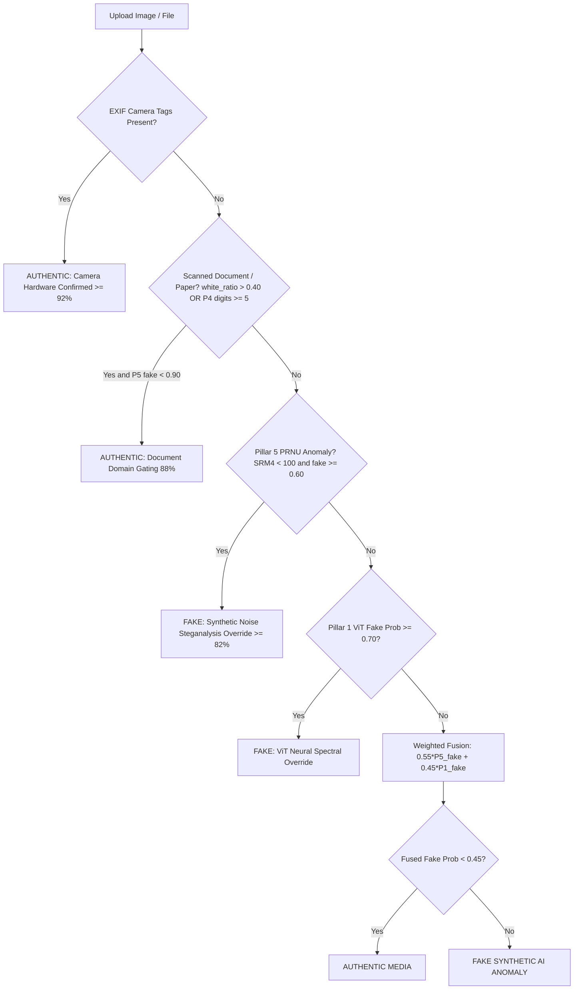

Viewed consensus.py:1-76
Viewed pillar1_engine.py:1-122
Viewed pillar3_engine.py:1-24
Viewed detect.py:1-100
Viewed detect.py:101-240
Viewed pillar4_engine.py:1-140
Viewed pillar5_engine.py:240-315
Viewed pillar2_engine.py:1-68

Here is the complete, point-by-point breakdown of the **exact numerical thresholds**, mathematical conditions, and decision boundaries used across **every single analytical pillar (1, 3, 4, 5)** and the **Master Consensus Engine**.

---

### Quick Overview: Who Analyzes What?

| Pillar | Focus Domain | Engine File | Primary Decision Boundary |
| :--- | :--- | :--- | :--- |
| **Pillar 1** | ViT Neural & Spectral Artifacts | [core/pillar1_engine.py](file:///d:/College%20Studies/Mini%20Project/core/pillar1_engine.py) | Softmax Probability $\ge 0.50$ (Neural Override at $0.70$) |
| **Pillar 3** | Audio, Voice Cloning & Music | [Pillar 3/detect.py](file:///d:/College%20Studies/Mini%20Project/Pillar%203/detect.py) | Averaged Chunk Probability $\ge 50.0\%$ |
| **Pillar 4** | Document, Invoice & Benford OCR | [core/pillar4_engine.py](file:///d:/College%20Studies/Mini%20Project/core/pillar4_engine.py) | Dynamic Benford MAE: Strict $\le 0.02$, Loose $\le 0.035$ |
| **Pillar 5** | Shadow Physics, Geometry & PRNU | [core/pillar5_engine.py](file:///d:/College%20Studies/Mini%20Project/core/pillar5_engine.py) | Ensemble Prob $\ge 0.50$ (Fallback: $\text{Var} < 12^\circ$, Inliers $\ge 20$) |
| **Consensus** | Domain-Aware Multi-Pillar Fusion | [core/consensus.py](file:///d:/College%20Studies/Mini%20Project/core/consensus.py) | Fused Fake Score $< 0.45 \implies$ **AUTHENTIC** |

---

### 1. PILLAR 1: Vision Transformer (ViT) & Spectral Forensics

*Source File:* [core/pillar1_engine.py](file:///d:/College%20Studies/Mini%20Project/core/pillar1_engine.py#L86-L109)  
*Model:* Fine-tuned Hugging Face `google/vit-base-patch16-224` (`best_pillar1_vit_v2.pth`).

#### Preprocessing & Normalization
* **Image Input Resolution:** Resized to $224 \times 224$ pixels.
* **ImageNet Normalization:** $\mu = [0.485, 0.456, 0.406]$, $\sigma = [0.229, 0.224, 0.225]$.

#### Probability Calculation
Logits are converted using Softmax:
$$\text{real\_prob} = \text{Softmax}(\text{logits})[0], \quad \text{fake\_prob} = \text{Softmax}(\text{logits})[1]$$

#### Classification Thresholds
* **Authentic Condition:**
  $$\mathbf{real\_prob \ge 0.50}$$
  * **Verdict:** `AUTHENTIC`
  * **Confidence:** $\text{real\_prob} \times 100\%$
* **Fake (AI-Generated) Condition:**
  $$\mathbf{real\_prob < 0.50} \quad (\text{fake\_prob} > 0.50)$$
  * **Verdict:** `FAKE (AI)`
  * **Confidence:** $\text{fake\_prob} \times 100\%$
* **Consensus Neural Override Threshold ([core/consensus.py:L52](file:///d:/College%20Studies/Mini%20Project/core/consensus.py#L52)):**
  $$\mathbf{p1\_fake\_prob \ge 0.70}$$
  If the ViT fake probability hits $70\%$, it triggers an immediate **hard override** in the consensus engine, bypassing physical shadow tests and flagging the file as `FAKE (SYNTHETIC AI ANOMALY)`.

---

### 2. PILLAR 3: Acoustic & Voice Synthetic Speech Forensics

*Source File:* [Pillar 3/detect.py](file:///d:/College%20Studies/Mini%20Project/Pillar%203/detect.py#L36-L215)  
*Model:* `Hemgg/Deepfake-audio-detection` (Wav2Vec2) + Librosa Harmonic-Percussive Source Separation (HPSS).

#### Preprocessing & Windowing
* **Sampling Rate:** Resampled to $16,000\text{ Hz}$ mono.
* **Window Duration:** $4.0\text{ seconds}$.
* **Hop Step:** $2.0\text{ seconds}$ sliding stride.

#### Audio Composition & Domain Thresholds
* **Harmonic-to-Percussive Ratio (HPR):**
  $$HPR = \frac{\text{Mean}(y_{\text{harm}}^2)}{\text{Mean}(y_{\text{perc}}^2) + 10^{-12}}$$
* **Music Heuristics Scoring:**
  * If $HPR > 1.4 \implies +0.40$
  * If $\text{perc\_power} > 0.005 \implies +0.35$
  * If $\text{rolloff} > 2500\text{ Hz}$ and $\text{flatness} > 0.015 \implies +0.25$
  * **Music Detection Threshold:**
    $$\mathbf{\text{music\_score} \ge 0.50 \quad \text{OR} \quad (HPR > 1.7 \text{ and } \text{perc\_power} > 0.004)}$$
* **Compressed VoIP / WhatsApp Audio Threshold:**
  $$\mathbf{\text{ZeroCrossingRate} < 0.08 \quad \text{AND} \quad \text{Centroid} < 500\text{ Hz} \quad \text{AND} \quad \text{perc\_power} < 0.004}$$
  *(Prevents mobile speech compression artifacts from being misclassified as synthetic cloning; recalibrates $\text{real\_raw} \ge 94.5\%$).*

#### Classification Thresholds
* **Model Classification Rule:**
  $$\text{fake\_conf} \ge \text{real\_conf} \quad (\ge 50.0\%)$$
  * If $\text{fake\_conf} \ge \text{real\_conf} \implies \mathbf{FAKE}$
  * If $\text{real\_conf} > \text{fake\_conf} \implies \mathbf{REAL}$
* **Studio Music Inconclusive Threshold:**
  If $HPR > 1.5$ in music mode, raw model predictions are bounded to $[40\%, 60\%]$ with an *"Inconclusive Studio Mastering"* warning.

---

### 3. PILLAR 4: Document, Invoice & Benford's Law Statistical OCR

*Source File:* [core/pillar4_engine.py](file:///d:/College%20Studies/Mini%20Project/core/pillar4_engine.py#L27-L97)  
*Technique:* PyTesseract OCR / PyMuPDF $\rightarrow$ 1st-Digit Extraction $\rightarrow$ Chi-Square ($\chi^2$) & Mean Absolute Error (MAE) distribution test.

#### Applicability Gate
* Let $N$ be the count of first significant digits ($1 \le d \le 9$).
* **Minimum Data Threshold:**
  $$\mathbf{N < 5} \implies \text{Non-Document / Inapplicable (Weight = 0.0)}$$

#### Theoretical vs. Observed Distribution
$$\text{Expected Frequency: } P(d) = \log_{10}\left(1 + \frac{1}{d}\right), \quad d \in [1, 9]$$
$$\text{MAE} = \frac{1}{9}\sum_{d=1}^{9} \left|\frac{\text{Count}(d)}{N} - P(d)\right|$$

#### Dynamic Sample-Size Scaled Thresholds
Because smaller sample sizes naturally have higher variance, thresholds scale dynamically based on sample size $N$:
$$\text{scale} = \frac{100.0}{\max(N, 30)}$$
$$\text{threshold\_strict} = 0.020 + (0.010 \times \text{scale})$$
$$\text{threshold\_loose} = 0.035 + (0.010 \times \text{scale})$$

#### Decision Boundaries
1. **Strictly Authentic Document:**
   $$\mathbf{\text{MAE} < \text{threshold\_strict}}$$
   * **Verdict:** `AUTHENTIC DOCUMENT`
   * **Confidence:** $95.0 - \left(\frac{\text{MAE}}{\text{threshold\_strict}}\right) \times 5.0 \quad (90\% \text{ to } 95\%)$
2. **Acceptable Authentic Document:**
   $$\mathbf{\text{threshold\_strict} \le \text{MAE} \le \text{threshold\_loose}}$$
   * **Verdict:** `AUTHENTIC DOCUMENT`
   * **Confidence:** $80.0 - \left(\frac{\text{MAE} - \text{threshold\_strict}}{\text{threshold\_loose} - \text{threshold\_strict}}\right) \times 20.0 \quad (60\% \text{ to } 80\%)$
3. **Forged / AI-Synthesized Document:**
   $$\mathbf{\text{MAE} > \text{threshold\_loose}}$$
   * **Verdict:** `FORGED / AI-SYNTHESIZED`
   * **Confidence:** $\min(99.9, 85.0 + (\text{MAE} \times 200))$
4. **Statistical Chi-Square P-Value Override:**
   $$\mathbf{p\_value < 0.01 \quad \text{AND} \quad \text{MAE} > 0.025}$$
   * Even if within border boundaries, a $p < 0.01$ indicates statistical deviation at $99\%$ confidence, flipping the verdict to **`FORGED / AI-SYNTHESIZED`** with $\ge 90\%$ confidence.

---

### 4. PILLAR 5: Physical Geometry & Shadow Physics Forensics

*Source File:* [core/pillar5_engine.py](file:///d:/College%20Studies/Mini%20Project/core/pillar5_engine.py#L95-L289)  
*Technique:* Canny Edge Detection + RANSAC Light Tracing + SRM Steganalysis + EfficientNet-B0 ML Ensemble.

#### Geometric Extraction Thresholds
* **Scale Normalization:** Scaled so $\max(H, W) = 800\text{ px}$.
* **Gaussian Filter:** Kernel size $(11, 11)$.
* **Adaptive Gaussian Thresholding:** Block size $21$, Constant $C = 5$.
* **Canny Edge Detection:** $\text{Low Threshold} = 50$, $\text{High Threshold} = 150$.
* **Hough Lines Detection:** $\text{Accumulator Threshold} = 70$, $\text{Min Line Length} = 60\text{ px}$, $\text{Max Line Gap} = 10\text{ px}$.
* **Angular Outlier Pre-Filter:** Discards lines where $|\theta - \theta_{\text{median}}| \ge 0.35\text{ radians}$ ($\approx 20^\circ$).
* **RANSAC Vanishing Point:**
  * Candidate VP intersection tested up to $800$ iterations.
  * Inlier line distance tolerance: $d < 50\text{ pixels}$.
* **Shadow Region Luma Gate:** Pixels where $L < \text{25th percentile of } L$.

#### Machine Learning Ensemble Decision
* Features: $24$ physics/color/frequency features + $1,280$ deep embeddings.
* **Classifier:** `pillar5_ml_model_v2.pkl` (Soft-voting ensemble of RandomForest, XGBoost, LightGBM).
* **Threshold:**
  $$\mathbf{real\_prob \ge 0.50 \implies \text{AUTHENTIC PHYSICS}}$$
  $$\mathbf{real\_prob < 0.50 \implies \text{PHYSICS ANOMALY (AI GENERATED)}}$$

#### Rule-Based Physics Fallback (If ML Bundle Unavailable)
If the model file is missing or throws an error, the deterministic geometric rule triggers:
$$\mathbf{\text{angular\_variance\_deg} < 12.0^\circ \quad \text{AND} \quad \text{max\_inliers} \ge 20 \quad \text{AND} \quad \text{shadow\_chroma\_var} \ge 10.0}$$
* **If satisfied:** Classified as **`AUTHENTIC PHYSICS`** ($94.0\%$ confidence).
* **If not satisfied:** Classified as **`PHYSICS ANOMALY`** ($94.0\%$ fake confidence).

#### Steganographic PRNU Noise Anomaly Override
Generative AI models suppress natural camera sensor noise. The 5th-order SRM high-pass residual filter variance detects this:
$$\mathbf{\text{srm\_var\_4} < 100.0}$$
* If $\text{srm\_var\_4} < 100.0$ and $\text{fake\_prob} < 0.60$:
  * Calculates artificial noise deficiency: $\text{fake\_prob} = \max(\text{fake\_prob}, 0.65 + 0.25 \times (1.0 - \frac{\text{srm\_var\_4}}{100.0}))$.
  * Immediately forces `is_real = False` $\implies$ **`PHYSICS ANOMALY (AI GENERATED)`** with status *"+ PRNU Noise Steganalysis Override"*.

---

### 5. THE MASTER CONSENSUS ENGINE: Final Unified Verdict

*Source File:* [core/consensus.py](file:///d:/College%20Studies/Mini%20Project/core/consensus.py#L17-L75)  
The consensus engine fuses the individual pillar outputs using a **hierarchical domain-gating and soft-voting cascade**:

#### Step-by-Step Priority Thresholds:

1. **Camera Sensor EXIF Signature (Tier 1 Priority):**
   * Checks for EXIF tags `0x010f` (Make), `0x0110` (Model), or `0x0131` (Software).
   * **Rule:** If present, **`is_unified_real = True`**, $\text{real\_prob} \ge 0.92$.
   * **Reason:** Authentic camera sensor signature confirmed.

2. **Physical Document Domain Gating (Tier 2 Priority):**
   * Condition: $\text{white\_ratio} > 0.40$ (over $40\%$ white paper background) OR (Pillar 4 $\text{digits} \ge 5$).
   * Guard: $\text{p5\_fake\_prob} < 0.90$.
   * **Rule:** If true, **`is_unified_real = True`**, $\text{real\_prob} = 0.88$.
   * **Reason:** Prevents flat 2D receipts, contracts, or text scans from being falsely penalized by 3D shadow vanishing point algorithms.

3. **Steganographic PRNU Noise Override (Tier 3 Priority):**
   * Condition: $\text{is\_prnu\_anomaly} = \text{True}$ ($\text{SRM}_4 < 100.0$) AND $\text{p5\_fake\_prob} \ge 0.60$.
   * **Rule:** If true, **`is_unified_real = False`**, $\text{fake\_prob} \ge 0.82$.

4. **Pillar 1 ViT Neural Spectral Override (Tier 4 Priority):**
   * Condition: $\text{p1\_fake\_prob} \ge 0.70$.
   * **Rule:** If true, **`is_unified_real = False`**, $\text{fake\_prob} = \text{p1\_fake\_prob}$.

5. **Calibrated Weighted Soft-Voting Consensus (Default State):**
   * Formula:
     $$\mathbf{\text{fused\_fake\_prob} = 0.55 \times \text{p5\_fake\_prob} + 0.45 \times \text{p1\_fake\_prob}}$$
   * **Deciding Threshold:**
     $$\mathbf{\text{fused\_fake\_prob} < 0.45 \implies \text{AUTHENTIC MEDIA}}$$
     $$\mathbf{\text{fused\_fake\_prob} \ge 0.45 \implies \text{FAKE (SYNTHETIC AI ANOMALY)}}$$
   * **Unified Confidence Score:**
     $$\text{Confidence} = \begin{cases} (1.0 - \text{fused\_fake\_prob}) \times 100\% & \text{if AUTHENTIC} \\ \text{fused\_fake\_prob} \times 100\% & \text{if FAKE} \end{cases}$$